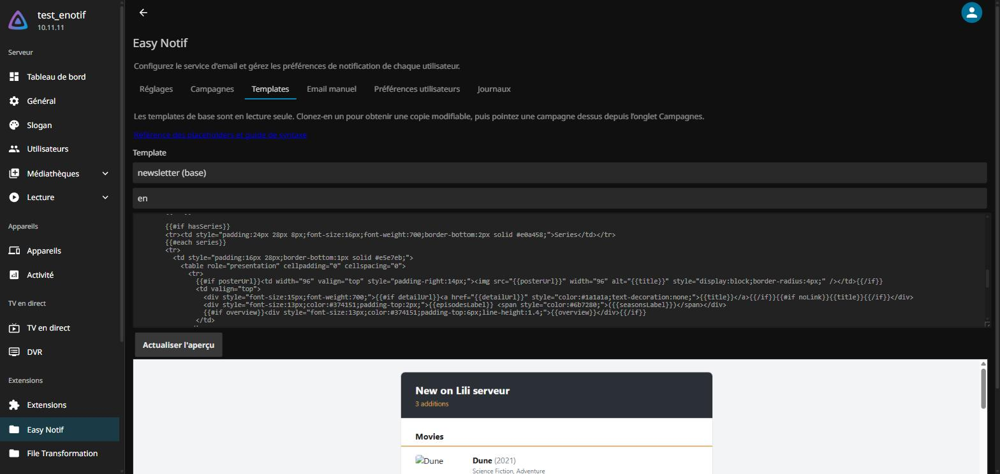

# Easy Notif

<p align="center">
  
  
  
  
</p>

An internal **email notification service** for your Jellyfin server. It replaces ad-hoc messaging
with three things:

- a **new-media newsletter** on a schedule you choose (weekly on a given day, monthly, every N days,
  or daily), with cover art and links back to each title;
- a **personalised weekly recap** for each user: what they watched this week and their running total
  for the year;
- **manual announcements** written from the dashboard, plain text or a full HTML template.

Each user picks which categories they want and sets their own contact address. The plugin reads the
library and playback data only. It never changes anything.

Part of the [JellyUX](https://github.com/JellyUX) plugin family.

---

## Screenshots

<p align="center">
  <br>
  <em>The Templates tab: clone a base template, edit the HTML, preview it with sample data. The
  Campaigns, Manual email, User preferences and Logs tabs sit alongside it.</em>
</p>

## Requirements

- **Jellyfin 10.11.10 or newer** (10.11.x line).
- The **[File Transformation plugin](https://github.com/IAmParadox27/jellyfin-plugin-file-transformation)**,
  used to inject the per-user settings panel into the web client. Without it the panel does not
  appear; the rest of the plugin still works.
- A **[Resend](https://resend.com)** account (free tier is enough) and a domain you can add DNS
  records to. You will publish SPF, DKIM and DMARC records for a dedicated sending sub-domain, and
  create an API key with **Sending access** scoped to that sub-domain.

## Installation

1. Jellyfin dashboard: **Plugins > Repositories > Add**, paste one of:
   ```
   https://raw.githubusercontent.com/JellyUX/Easy_Notif/main/manifest.json
   ```
   or, for the whole JellyUX suite:
   ```
   https://raw.githubusercontent.com/JellyUX/.github/main/manifest.json
   ```
2. **Plugins > Catalog**, install **Easy Notif**, restart Jellyfin.
3. Open **Dashboard > Plugins > Easy Notif**.

## Configuration

### 1. Sending domain (Resend)

Add a **dedicated sub-domain** in Resend (for example `send.example.com`, not the root domain, so
your existing mail is never touched). Resend gives you an MX record, an SPF `TXT` and a DKIM `TXT`;
add them at your DNS host as **plain records, not proxied**, then add a DMARC `TXT` on
`_dmarc.send.example.com` (`v=DMARC1; p=none; rua=mailto:you@example.com`). Click **Verify** until
all records are green.

### 2. API key and webhook

- **API Keys > Create API Key**: permission **Sending access**, scoped to the sub-domain. Copy the
  `re_...` value once.
- **Webhooks > Add Endpoint**: URL `https://<your-jellyfin>/EasyNotif/webhooks/resend`, events
  `email.sent`, `email.delivered`, `email.delivery_delayed`, `email.bounced`, `email.complained`.
  Copy the `whsec_...` **Signing Secret**.

### 3. The Settings tab

Fill in the **Settings** tab of the plugin config page:

| Field | Value |
|---|---|
| Resend API key | the `re_...` key (stored in Jellyfin's config, masked on read, never logged) |
| Webhook signing secret | the `whsec_...` secret |
| From address | any address on the verified sub-domain (it does not need a real mailbox) |
| From name | what recipients see as the sender |
| Reply-To | optional; a real address if you want replies to reach you |
| Public server URL | your Jellyfin's public URL, used to build poster links and deep links |

The **Status** block on that tab shows the transport state, the monthly send quota, the last
webhook received, and the two campaigns.

Schedules run in **Europe/Paris** by default; change it on the Campaigns tab (any IANA time zone).

## Using it

- **Campaigns tab**: the newsletter and the weekly recap ship disabled. Set a schedule, pick a
  language and (optionally) a custom template, enable it. **Send a preview to me** mails the current
  content to your own contact address.
- **Templates tab**: the two built-in templates are read-only. Clone one, edit the HTML, preview it
  with sample data, and point a campaign at your copy. Placeholder reference and the template
  mini-language: [docs/CUSTOM_TEMPLATES.md](docs/CUSTOM_TEMPLATES.md).
- **Manual email tab**: a one-off announcement to every user with a contact address, or a chosen
  subset. Not subject to category preferences.
- **Per-user panel** (in each user's Jellyfin settings): contact address, category opt-in/opt-out,
  a test-send button.
- **Unsubscribe**: every campaign email carries a one-click `List-Unsubscribe` header and a footer
  link to a small confirmation page. Changes take effect immediately.

## Privacy and uninstall

Every piece of state the plugin keeps lives in **one directory**,
`<jellyfin-data>/Jellyfin.Plugin.EasyNotif/` (preferences, campaigns, playback history, custom
templates, quota, logs). The plugin never writes anywhere else. Contact addresses go to **Resend**
(United States) to send the mail; nothing is sent to any other third party.

To remove everything: uninstall the plugin and delete that directory. The server is then exactly as
it was before.

## License

GPL-3.0. See [LICENSE.md](LICENSE.md).
